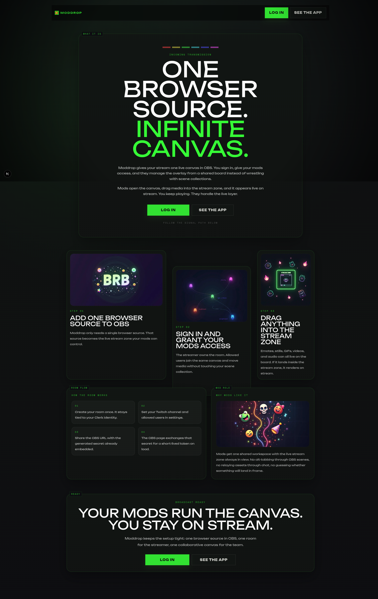

<div align="center">
  
  <h1>Moddrop</h1>
  <p><strong>One browser source. Infinite canvas.</strong></p>
  <p>Shared live overlay control for streamers and mods.</p>
  <p>
    
    
    
    
  </p>
</div>

Moddrop gives a stream one live canvas inside OBS. The streamer owns the room, invited mods join the same board, and media dropped into the stream zone renders live without scene juggling.

## Stack

`Next.js` `React` `Clerk` `Convex` `tldraw` `Hono` `WebSocket` `SQLite` `Bun`

## Run

```bash
bun install
bun run dev
bun run dev:convex
bun run dev:canvas
```

`frontend.localhost:1355`  
`stream-canvas.localhost:1355`

## Check

```bash
bun run lint && bun run typecheck && bun run test && bun run build
cd backend/stream-canvas && bun run typecheck && bun run test
```
