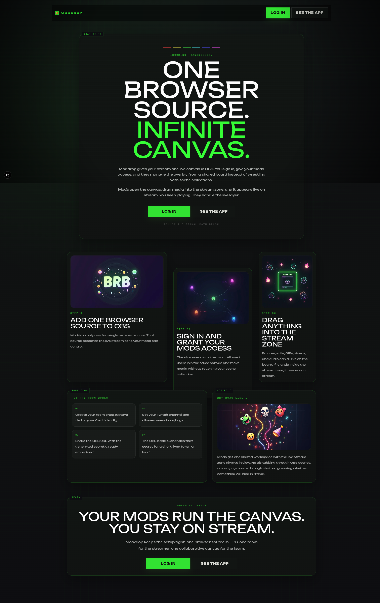

<div align="center">
  
  <h1>Moddrop</h1>
  <p><strong>One browser source. Infinite canvas.</strong></p>
  <p>Shared live overlay control for streamers and mods.</p>
  <p>
    
    
    
    
  </p>
</div>

Moddrop gives a stream one live canvas inside OBS. The streamer owns the room, invited mods join the same board, and media dropped into the stream zone renders live without scene juggling.

## Stack

`Next.js` `React` `Clerk` `Convex` `tldraw` `Hono` `WebSocket` `PostgreSQL` `Drizzle` `Garage/S3` `pnpm`

## Run

```bash
pnpm install
pnpm dev
```

`pnpm dev` owns the whole local lifecycle: it starts PostgreSQL, waits for its
health check, applies the Drizzle migrations, and then launches the Portless
frontend and canvas routes plus Convex. Pressing Ctrl-C stops the applications
and removes the Compose container and network; the named database volume is
kept for the next run. Clerk Development instance credentials are loaded from
the shared Infisical development project into both applications without being
written to disk. Local startup rejects `pk_live_` / `sk_live_` keys because
Clerk restricts the production instance to `moddrop.live`; it requires the
matching `pk_test_` / `sk_test_` pair instead. If needed, authenticate once with
`infisical login --domain http://192.168.60.11:8080`. Set
`MODDROP_DEV_DATABASE_URL` only when intentionally using a different
development PostgreSQL instance. With that override, startup and shutdown leave
the default Compose database alone. The default database port is loopback-only.

- `https://moddrop.localhost:1355`
- `https://moddrop-stream-canvas.localhost:1355`

See [the stream canvas backend guide](./backend/stream-canvas/README.md) for
the data model, migration flow, and production storage design.

## Check

```bash
CANVAS_TEST_DATABASE_URL=<isolated-test-database-url> bash scripts/verify.sh
```

Use the pinned Node/pnpm versions and a disposable PostgreSQL database, never an
application database. The canonical script checks formatting, lint, application
and test types, unit/integration tests, builds, compiled runtime configuration,
and browser flows. See the backend guide's verification section for setup.
